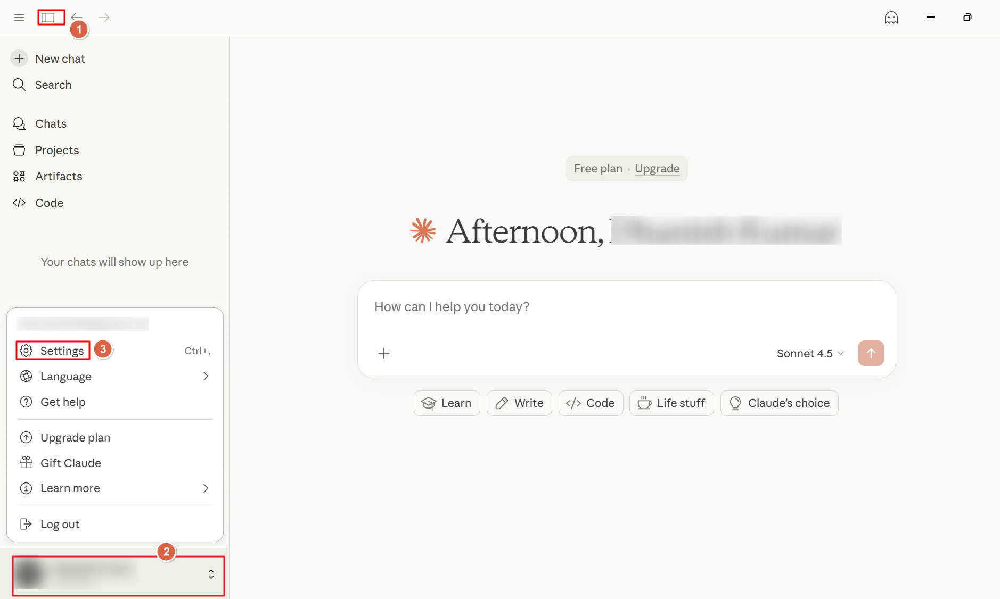
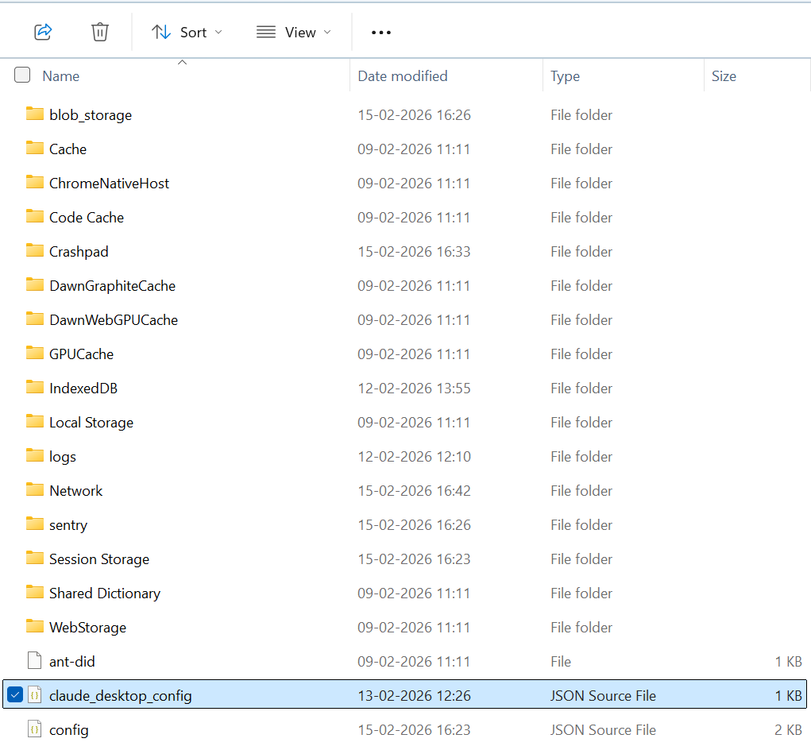
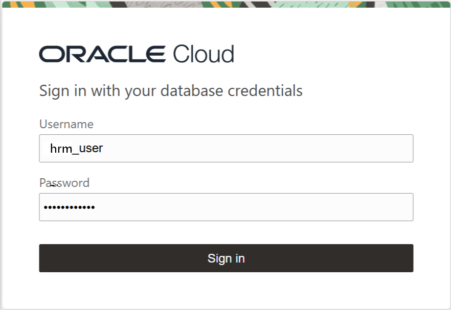

# Configure Claude Desktop

## Introduction

This lab guides you step-by-step through setting up Claude Desktop, an advanced AI assistant developed by Anthropic for natural language understanding and productivity support. You will learn how to connect Claude Desktop as an MCP client to the Oracle Autonomous AI Database MCP Server.

Estimated Time: 15 Minutes

### Objectives

In this lab, you will:

* Set up Node.js on your system
* Install Claude Desktop
* Set up Claude Desktop as an MCP Client
* Select and manage tool access through Claude Desktop

### Prerequisites

- This lab requires completion of Lab 1 and Lab 3 in the **Contents** menu on the left.


## Task 1: Install Claude Desktop

You need to install Claude Desktop on your computer based on your operating system — Windows or Mac. Choose from:

#### On Windows

1. Visit the [Claude Desktop download page](https://support.claude.com/en/articles/10065433-installing-claude-desktop).
2. Download and run the Windows installer (.exe or .msix).
3. Follow the installation wizard instructions.
4. Open the Claude application from your Start Menu or desktop.
5. Sign in to Claude with your Anthropic account (use two-factor authentication if prompted).
6. Test Claude Desktop by asking it a question.

#### On Mac

1. Visit the [Claude Desktop download page](https://support.claude.com/en/articles/10065433-installing-claude-desktop).
2. Download the .dmg file and open it.
3. Drag the Claude app into your Applications folder.
4. Launch the app and sign in with your Anthropic account.
5. Test the app by asking a simple question.

## Task 2: Install Node.js

You need to install Node.js because Claude Desktop uses Node.js-based tools and scripts to interact with the Autonomous AI Database MCP Server. Installing Node.js ensures these tools work correctly for the integration process.

Install Node.js based on your computer based on your operating system — Windows or Mac. Choose from:

#### On Windows
1. Go to the [Node.js download page](https://nodejs.org/en/download).
2. Download the Windows Installer (.msi) for the LTS version.
3. Double-click the .msi file and follow the prompts to install, keeping default settings.
4. Open Command Prompt or PowerShell, then type:

    ```
    <copy>
    node -v
    npx -v
    npm -v
    </copy>
    ```

    This should display the installed versions.

#### On Mac
1. Go to the [Node.js download page](https://nodejs.org/en/download).
2. Download the macOS Installer (.pkg) from the Node.js site .
3. Open the .pkg file and follow the on-screen instructions.
4. Enter your Mac password if prompted.
5. Open Terminal and check the installation by running:

    ```
    <copy>
    node -v
    npm -v
    </copy>
    ```
    
    This should display the installed versions.


## Task 3: Configure Claude Desktop as an MCP client

You'll update the Claude Desktop configuration so it can connect to the Autonomous AI Database MCP Server. You will edit a configuration file and provide the necessary server details, enabling Claude Desktop to access tools and data from your database.

1. Open the Claude Desktop application.
       - If prompted, sign in using your account credentials.
2. Go to **Settings**. 
3. In **Settings**, select the **Desktop App** section, then click **Developer**.
4. Click **Edit Config** to open or edit the `claude_desktop_config` JSON configuration file.
5. Add the following JSON configuration to define your MCP server:

    ```
    <copy>
    {
      "mcpServers": {
        "Autonomous_AI_database_mcp_server": {
          "description": "Database containing application-related data",
          "command": "npx",
          "args": [
            "-y",
            "mcp-remote",
            "https://dataaccess.adb.{region-identifier}.oraclecloud.com/adb/mcp/v1/databases/{database-ocid}",
            "--allow-http"
          ],
          "transport": "streamable-http"
        }
      }
    }
    </copy>
    ```
    - Replace `{region-identifier}` with your Oracle Cloud region.
    - Replace `{database-ocid}` with the OCID of your Autonomous AI Database.
6. **Save** the configuration file.
7. **Completely quit** Claude Desktop and ensure it is not running in the background.  
       - On Windows, open Task Manager, search for any running Claude processes, and end all of them before restarting the app.
8. When prompted, enter your following database credentials:
    - Username: **sales_user**
    - Password: **QwertY#19_95**
    
9. Claude Desktop will detect the available database tools for your user profile.


## Task 4: Review and Control Tool Access

Before you begin using Claude Desktop with your Autonomous AI Database, it's important to review and manage which tools the MCP client can access. In this step, you will learn how to view the available tools and control their permissions, ensuring that only approved tools are accessible through Claude Desktop.

1. In Settings under Developer, confirm your MCP server connection is listed and running.
Navigate to Connectors. 
2. You should see "Autonomous\_AI\_database\_mcp\_server" (or the name you assigned in the config) listed as an MCP server. Click Configure.
3. Review the tools available to Claude Desktop. 
4. By default, all tools require your approval.
5. To always allow a tool, click the circled checkmark.
6. To block a tool, click the lined circle (the tool will not be visible to Claude Desktop).

You may now proceed to the next lab.

## Learn More

* [OML Notebooks](https://docs.oracle.com/en/database/oracle/machine-learning/oml-notebooks/index.html)
* [Using Oracle Autonomous AI Database Serverless](https://docs.oracle.com/en/cloud/paas/autonomous-database/adbsa/index.html)
* [How to help AI models generate better natural language queries](https://blogs.oracle.com/datawarehousing/post/how-to-help-ai-models-generate-better-natural-language-queries-in-autonomous-database)

## Acknowledgements

* **Authors:** Sarika Surampudi, Principal User Assistance Developer; Dhanish Kumar, Senior Member of Technical Staff
* **Contributors:** Chandrakanth Putha, Senior Product Manager; Mark Hornick, Senior Director, Machine Learning and AI Product Management

Copyright (c) 2026 Oracle Corporation.

Permission is granted to copy, distribute and/or modify this document
under the terms of the GNU Free Documentation License, Version 1.3
or any later version published by the Free Software Foundation;
with no Invariant Sections, no Front-Cover Texts, and no Back-Cover Texts.
A copy of the license is included in the section entitled [GNU Free Documentation License](https://oracle-livelabs.github.io/adb/shared/adb-15-minutes/introduction/files/gnu-free-documentation-license.txt)
