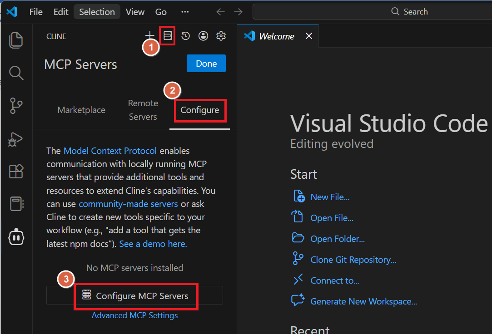
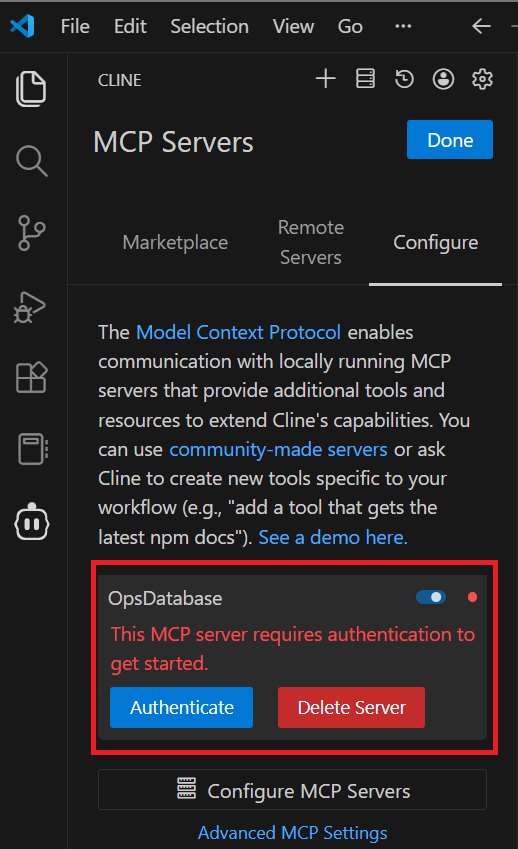

# Configure Cline on Visual Studio Code

## Introduction

In this lab, you will learn how to set up and use the Cline extension within Visual Studio Code to act as an MCP (Model Control Protocol) client for Oracle Autonomous AI Database MCP Server. 
Cline is a Visual Studio Code extension that enables seamless connection and interaction with Oracle MCP (Model Control Plane) servers, making it easier for developers to manage, test, and invoke AI models and tools from within their development environment.

Estimated Time: 15 Minutes

### Objectives

In this lab, you will:

* Generate a bearer token using cURL
* Integrate the Cline extension into Visual Studio Code as an MCP client
* Configure Cline to securely connect to your Autonomous AI Database MCP Server using bearer token authorization
* Select and manage tool access through Cline extension

### Prerequisites

- Installed Visual Studio Code on your system
- This lab requires completion of Lab 1 and Lab 3 in the **Contents** menu on the left.

## Task 1:  Verify or Install Visual Studio Code 

If you already have Visual Studio Code installed on your system, you may skip this step and proceed to Task 2.

If Visual Studio Code is not installed, follow the instructions below to install it. Install Visual Studio Code on your computer based on your operating system — Windows or Mac. Choose from:

#### For Windows:

1. Go to the official [download page](https://code.visualstudio.com/download)
2. Download the Windows installer (.exe file).
3. Run the installer and follow the instructions in the setup wizard.
4. Once installed, launch Visual Studio Code from the Start menu.

#### For macOS:

1. Go to the official [download page](https://code.visualstudio.com/download)
2. Download the macOS installer (.dmg file).
3. Open the .dmg file and drag Visual Studio Code into your Applications folder.
4. Launch Visual Studio Code from Applications.

## Task 2: Install the Cline Extension for Visual Studio Code

In this task, you will install the Cline extension in Visual Studio Code

1. In Visual Studio Code, click on the Extensions icon. 
2. In the Activity Bar (or use Ctrl+Shift+X) Search for "Cline".
3. Click Install next to the Cline extension.
4. If prompted, click Trust Publisher & Install. 
5. Once installed, the Cline extension icon will appear in the Activity Bar. 
6. If this is your first time using Cline, open the extension to complete any AI provider settings as instructed.

## Task 3: Generate a Bearer Token Using cURL

1. To authenticate with the MCP server, you must obtain a bearer token via an HTTP POST request to the OAuth 2.1 token endpoint of your Autonomous AI Database. 
2. Use the following cURL command, replacing placeholders as appropriate.

  > **Note:** You can also use the Cloud Shell or Cloud Editor available in OCI to run your cURL command directly. These environments come with cURL already installed and configured, making it convenient if local setup is not available or if you prefer to run commands securely in your cloud environment. 

  ```
  <copy>
  curl --location 'https://dataaccess.adb.{region-identifier}.oraclecloudapps.com/adb/auth/v1/databases/{database-ocid}/token' \
    --header 'Content-Type: application/json' \
    --header 'Accept: application/json' \
    --data '{
      "grant_type": "password",
      "username": "<db-username>",
      "password": "<db-password>"
    }'
  </copy>
  ```

    - Replace {region-identifier} with your Oracle Cloud region
    - Replace {database-ocid} with your database’s OCID of your Autonomous AI Database
    - Replace `<db-username>` and `<db-password>` with your databse credentials - Username: **hrm\_user** and Password: **QwertY#19\_95**

3. Run the cURL command in Command Prompt (Windows), Terminal (macOS), or another CLI tool.
4. The bearer token will be returned in the response. Copy and securely store this token.

**Note:** 

- Bearer tokens are valid for 1 hour.
- Keep your credentials secure and do not share tokens publicly.
- You may also generate tokens using Postman or similar tools.

## Task 4: Configure Cline as an MCP Client Using Bearer Token Authorization

1. In Visual Studio Code, click the Cline icon in the Activity Bar. 

2. Go to MCP Servers and choose to add or modify a server connection. 

3. Use the following example as a template for MCP server configuration, cline_mcp_setting.json, replacing placeholders where necessary:
    ```
    <copy>
    {
      "mcpServers": {
        "OpsDatabase": {
          "timeout": 300,
          "type": "streamableHttp",
          "url": "http://dataaccess.adb.{region-identifier}.oraclecloudapps.com/adb/mcp/v1/databases/{database-ocid}",
          "headers": {
            "Authorization": "Bearer <your-token>"
          }
        }
      }
    }
    </copy>
    ```

    - Replace {region-identifier}, {database-ocid}, and <your-token> with your actual values.

4. Save and close the configuration file.
5. After saving the configuration file, cline extension may ask to authenticate. If prompted, complete the authentication process to enable full functionality of the extension. 
5. Restart your AI agent application if necessary.
6. In the MCP Servers panel, you should now see "OpsDatabase" listed.
7. Expand the "OpsDatabase" entry to view available tools, parameters, and definitions.

## Learn More

* [Select AI with RAG](https://docs.oracle.com/en/cloud/paas/autonomous-database/serverless/adbsb/select-ai-retrieval-augmented-generation.html#GUID-6B2A810B-AED5-4767-8A3B-15C853F567A2)
* [Select AI with OCI Generative AI Example](https://docs.oracle.com/en/cloud/paas/autonomous-database/serverless/adbsb/select-ai-examples.html#GUID-BD10A668-42A6-4B44-BC77-FE5E5592DE27)
* [OML Notebooks](https://docs.oracle.com/en/database/oracle/machine-learning/oml-notebooks/index.html)
* [Using Oracle Autonomous Database Serverless](https://docs.oracle.com/en/cloud/paas/autonomous-database/adbsa/index.html)
* [How to help AI models generate better natural language queries](https://blogs.oracle.com/datawarehousing/post/how-to-help-ai-models-generate-better-natural-language-queries-in-autonomous-database)

## Acknowledgements

* **Authors:** Sarika Surampudi, Principal User Assistance Developer; Dhanish Kumar, Senior Member of Technical Staff
* **Contributors:** Chandrakanth Putha, Senior Product Manager; Mark Hornick, Senior Director, Machine Learning and AI Product Management


Copyright (c) 2026 Oracle Corporation.

Permission is granted to copy, distribute and/or modify this document
under the terms of the GNU Free Documentation License, Version 1.3
or any later version published by the Free Software Foundation;
with no Invariant Sections, no Front-Cover Texts, and no Back-Cover Texts.
A copy of the license is included in the section entitled [GNU Free Documentation License](https://oracle-livelabs.github.io/adb/shared/adb-15-minutes/introduction/files/gnu-free-documentation-license.txt)
