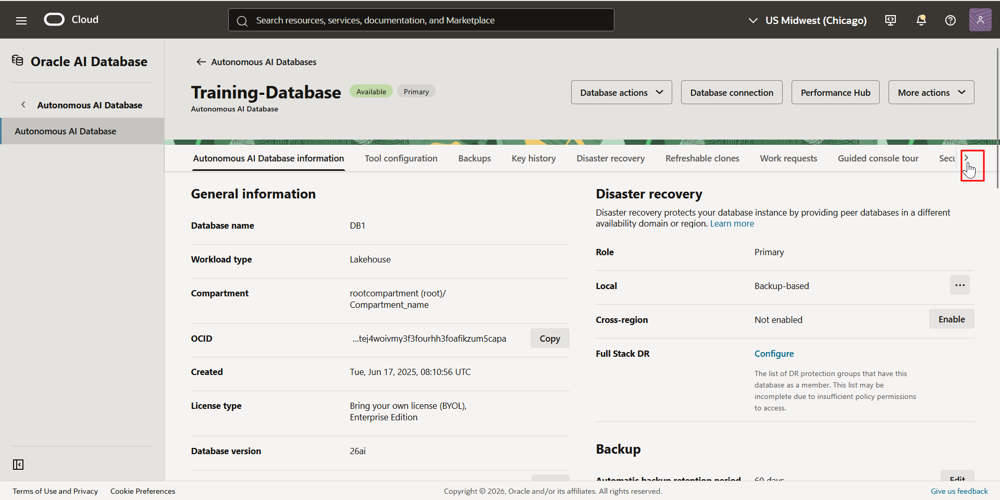
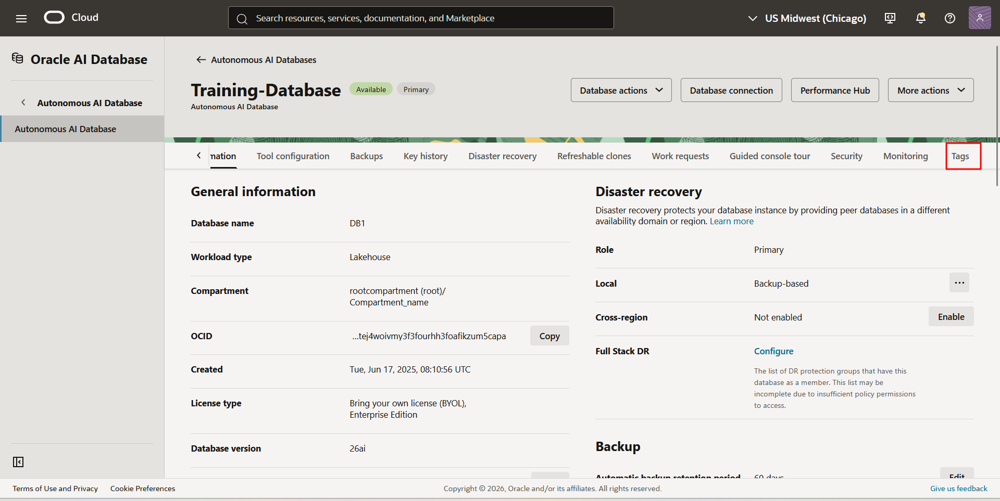
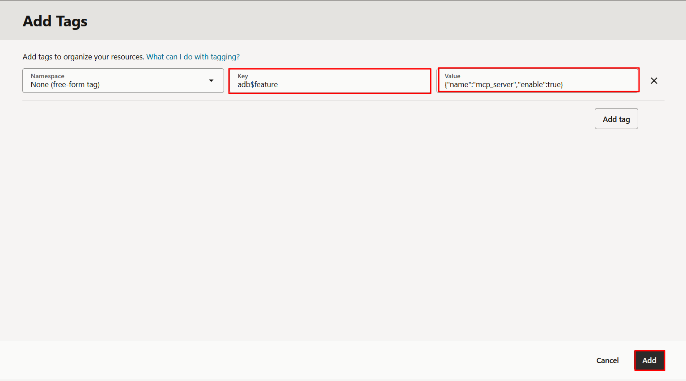
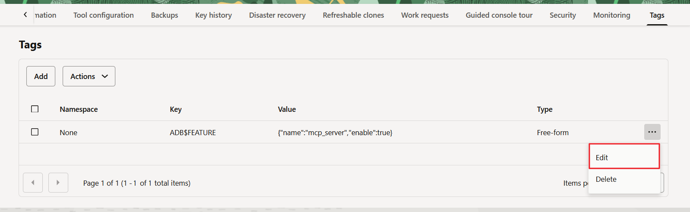
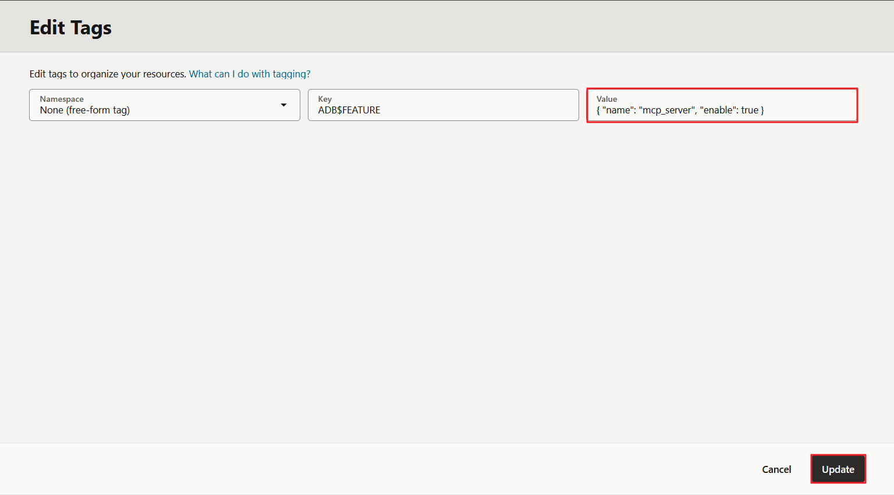
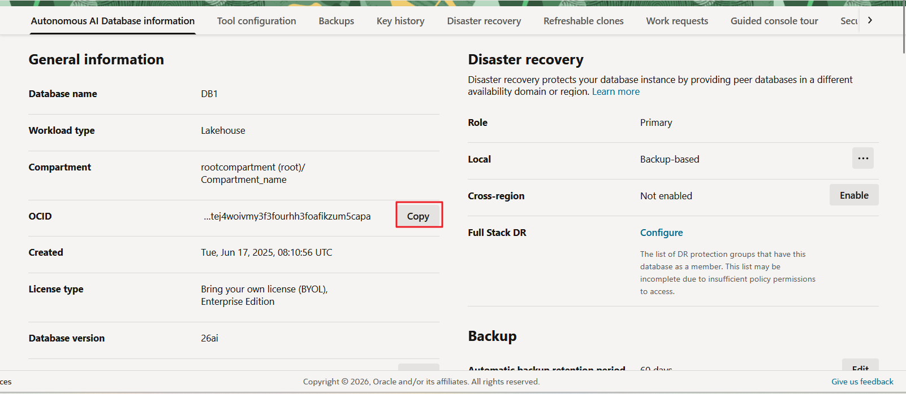

# Enable and Manage MCP Server

## Introduction

In this lab, you enable, disable, and re-enable MCP server for an Oracle Autonomous AI Database Serverless instance. The MCP Server exposes database tools that MCP clients can discover and invoke using natural language prompts.

You manage MCP Server using OCI free-form tags and verify its operational state. This lab focuses strictly on lifecycle management of the MCP feature.

This lab establishes the foundation for integrating AI clients with Autonomous AI Database tools.

Estimated Time: X

### Objectives

In this lab, you will:

* Enable MCP Server using OCI free-form tags
* Disable MCP Server
* Re-enable MCP Server
* Obtain Autonomous AI Database instance OCID

### Prerequisites

This lab requires completion of the previous labs in the **Contents** menu on the left.


## Task 1: Enable MCP Server
To enable MCP Server: 

1. Go back to the Autonomous AI Database Serverless instance details page.
2. Scroll to the right on the tools menu. 
  

3. Click **Tags**.
  

4. Click **Add**.
  

5. Enter the following and click **Add**:
    ```
    Key: adb$feature
    Value: {"name":"mcp_server","enable":true}

    ```
    

MCP Server is enabled for this database instance.

## Task 2: Disable MCP Server

Disabling MCP Server stops new MCP client connections and tool calls. Any requests already in progress will be allowed to complete. 

You will now modify the same free-form tag created in **Task 1**.

1. On the **Tags** tab, click the three dots (...) next to the **Free-form** tag.

2. Click **Edit**.
  

3. Modify the **Value** field to:

    ```
    <copy>
      { "name": "mcp_server", "enable": false } 
    </copy>
    ```

    

4. Click **Update**.

Once the MCP Server is disabled, it stops accepting new client connections.

## Task 3: Re-enable MCP Server

You will now re-enable MCP Server using the same tag.

1. On the **Tags** tab, click the three dots (...) next to the **Free-form** tag.

2. Click **Edit**.

3. Modify the **Value** field to:

    ```
    <copy>
      { "name": "mcp_server", "enable": true } 
    </copy>
    ```
4. Click **Update**.
  


## Task 4: Obtain Autonomous AI Database OCID
Obtain the database instance OCID. You will use this in **Lab 4** and **Lab 5**.

To obtain the OCID:
1. Navigate (Scroll to the left on the Tool menu) back to the Autonomous AI Database information page.
2. Click **Copy** next to the **OCID**.
  


## Quiz
```quiz score

Q: How is MCP Server enabled on an Autonomous AI Database instance?

- By running a PL/SQL package
- By editing the database initialization parameter file
* By adding a free-form tag in the OCI Console
- By installing a client extension
>The MCP Server is enabled by adding a free-form tag (adb$feature) in the OCI Console with the appropriate JSON value.

Q: What is the correct JSON value to enable the MCP Server?

- {"mcp_server":"true"}
- {"name":"mcp","enable":true}
- {"feature":"mcp_server","status":"on"}
* {"name":"mcp_server","enable":true}
>The correct tag value is {"name":"mcp_server","enable":true}. This activates the MCP feature for the database instance.

Q: What happens when the MCP Server is disabled?

- The database shuts down
- Existing database connections are terminated
* New MCP client connections are blocked
- All tools are deleted automatically
>Disabling the MCP Server prevents new MCP client connections, but the database itself continues running normally.

Q: Where do you manage the MCP Server configuration?

- Database Actions → SQL Worksheet
* OCI Console → Autonomous AI Database → Tags
- SQL Developer
- Cline Extension
>MCP Server lifecycle management is handled in the OCI Console under the database instance’s Free-form Tags section.

Q: After modifying the MCP free-form tag, what should you verify?

- That Node.js is installed
* That the tag value reflects the correct enable state
- That all schemas are visible
- That the database password is reset
>After updating the tag, verify that the value reflects "enable":true or "enable":false and that the database remains in the Available state.
```

You may now proceed to the next lab.

## Learn More

* [Using Oracle Autonomous AI Database Serverless](https://docs.oracle.com/en/cloud/paas/autonomous-database/serverless/adbsb/autonomous-intro-adb.html)
* [Oracle Autonomous AI Database MCP Server Documentation](https://docs.oracle.com/en/cloud/paas/autonomous-database/serverless/adbsb/mcp-server.html#GUID-22D738E1-BC06-47F0-9684-CD698DD8C492)


## Acknowledgements

* **Author:** Sarika Surampudi, Principal User Assistance Developer
* **Contributors:** Chandrakanth Putha, Senior Product Manager; Mark Hornick, Senior Director, Machine Learning and AI Product Management
<!--* **Last Updated By/Date:** Sarika Surampudi, August 2025
-->


Copyright (c) 2026 Oracle Corporation.

Permission is granted to copy, distribute and/or modify this document
under the terms of the GNU Free Documentation License, Version 1.3
or any later version published by the Free Software Foundation;
with no Invariant Sections, no Front-Cover Texts, and no Back-Cover Texts.
A copy of the license is included in the section entitled [GNU Free Documentation License](https://oracle-livelabs.github.io/adb/shared/adb-15-minutes/introduction/files/gnu-free-documentation-license.txt)
