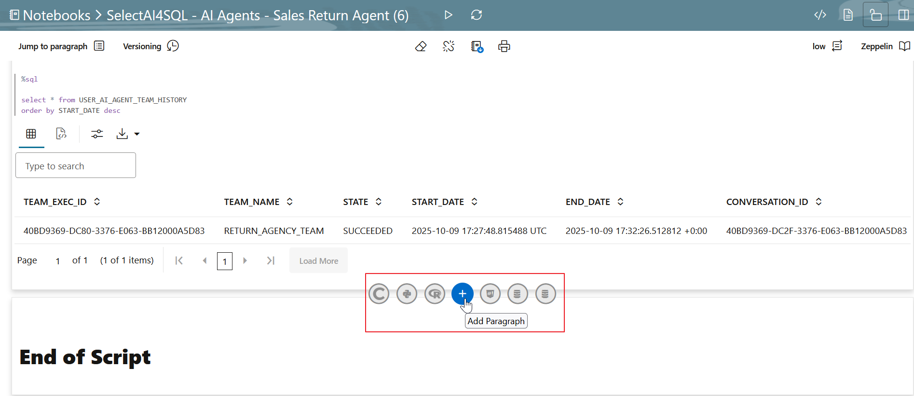

# Use the Ask Oracle Chatbot App

## Introduction

Before creating your own Select AI agents, this lab provides a hands-on tour of the “Ask Oracle” demo chatbot app. Here, you’ll use the chatbot to run the agent team created and enhanced in the previous labs. While we’ll focus on interacting with an agent team, this APEX-based app allows you to interact with your data using natural language prompts for RAG and NL2SQL with AI profiles already defined. You’ll open the app, review at the settings, specify NL2SQL   and RAG AI profiles, and pick an AI Agent. Then, try a few prompts - just click and chat.


Estimated Time: 10 minutes.

### Objectives

In this lab, you will:
* Access the Ask Oracle chatbot app.
* Review the **Settings**.
* Choose an AI Agent to chat with.
* Run some sample prompts.

### Prerequisites
- This lab requires the completion of all the preceding labs in the **Contents** menu on the left.
- Autonomous Database is reachable from your browser environment.

## Task 1: Create NL2SQL Profile
To create NL2SQL profile:
1. Add a paragraph in your OML Notebook by clicking the **+** symbol.


2. Create a NL2SQL Profile by pasting the following code.
  ```
  <copy>
BEGIN
  DBMS_CLOUD_AI.CREATE_PROFILE(
      profile_name >'OCI_GENAI',
      attributes   =>'{"provider": "oci",
      "credential_name": "AI_CREDENTIAL",
      "conversation": "true",
      "object_list": [{"owner": "SH", "name": "customers"},
                      {"owner": "SH", "name": "countries"},
                      {"owner": "SH", "name": "supplementary_demographics"},
                      {"owner": "SH", "name": "profits"},
                      {"owner": "SH", "name": "promotions"},
                      {"owner": "SH", "name": "products"}]
        }');
 END;
 /
  </copy>
  ```

## Task 2 Access the Application

1. Launch the demo app. Paste the URL in a new tab in your Web browser, and then click **[ENTER]**. In the **Ask Oracle** page, enter the username and password, and then click **Sign In**. Refer to **Lab 1 -> Task 4**.

  

2. The **Ask Oracle Chatbot using Select AI** chatbot application is displayed. On the top right-hand corner, click the user icon. 
    

3. Click **Settings** from the menu. 
    

4. The **Settings** screen pops up with different tabs: **NL2SQL Profile**, **RAG Profile**, **AI Agents Teams**, **Account**, and **About**. Choose the following by clicking each tab and selecting the corresponding object:

  a. NL2SQL Profile – `OCI_GENAI[NL2SQL]`

      

  b. RAG Profile – `SALES_AGENT_RAG_PROFILE`
      

  c. AI Agent Teams – `RETURN_AGENCY_TEAM`
      

For example, pick the agent team **`RETURN_AGENCY_TEAM`** and click the **X** in the upper right to close the **Settings** screen.

5. In the **Enter prompt** text area, click the **+** and select **Agents**. 
      

    Notice that the bottom right indicates that agent team is `RETURN_AGENCY_TEAM`.

      

You are now ready to ask questions at the Enter prompt area!


## Task 3: Interact with the Sales Return Agent

For example, follow this script:
- “I want to return a smartphone case”
- “The item is defective”
- “I will need a replacement”
- “I'm Bob Martinez and my order number is 7820”
- “No thank you”

## Task 4: (Optional) Ask Natural Language and Database Questions Using the Application

You can use this application to interact with the LLM and your database in a variety of ways:

- **Ask the LLM Directly:**
Click the **+** and select **NL2SQL**. _Uncheck the  **Database** checkbox_ to provide direct prompts to your LLM about anything such as:

  _What is Oracle Autonomous Database?_
  
  This prompt is sent to the LLM that you selected when you created the profile and returns the response.

  

- **Ask your Database :**
Click the **+** and select **NL2SQL**. _Select the **Database** checkbox_ to ask questions about your database data based on the user and tables in the database that you specified when you created the profile such as:

  _How many customers do I have in each country?_

  

- **Generate narrated result:**
_Check the **Database** and **Narrate** checkbox_ to ask questions about your database data based on the user and tables in the database specified in the AI profile such as:

  _How many customers are females?_

    

  **Have an interactive conversation**

  Select AI supports short-term, session based conversations, which are enabled in the AI profile by setting the `converstion` parameter to `true`. Refer to **Task 1 -> Step 2** of this lab.


1. Uncheck **Narrate**. Use the following prompt:

  _How many customers do I have in each country?_

  Ask another follow up question such as:

  _Break that out by gender_

    

3. Click **Explain**. 

    

  The following screen displays:

    

  When finished viewing, click the back arrow and continue with the following script:

  _Can you change that to have the country in one column and other columns such as male, female and total?_

  _Display this result in a bar chart_

  _Put the results in descending_

  _How many customers do I have in each country?_


- **Use RAG:**
Click **+** and select **RAG** to ask questions using retrieval augmented generation (RAG). Before you submit the prompt, ensure that the RAG profile `SALES_AGENT_RAG_PROFILE` created earlier in **Lab 5** is selected. Ask questions relative to the corresponding vector index content for Select AI to augment your prompt with relevant content for the LLM. We have created a vector index in **Lab 5** -> **Task 1**.

1. First, we’ll just ask our LLM without RAG, so select the **Chat** checkbox. The LLM returns a general response describing Select AI RAG capabilities based on its training, without using any content from your vector index.

  _What are the benefits of Select AI for retrieval augmented generation (RAG)?_

    

2. Uncheck **Chat** and then ask:

  _what are alternatives for the smartphone case_

  > **Tip**: Ask a question based on the RAG profile you selected, which references the documents stored in your vector database. 
  
  Select AI now uses retrieval augmented generation to ground the response in your vector index. The LLM returns recommendations based on the content of your documents, not general model knowledge.

3. Let’s see the specific chunks provided to the LLM, so select the **Show chunk details** checkbox.

  _What do I need to specify in my AI profile to enable RAG?_

  

  Select AI splits source documents into smaller units called chunks and stores them in the vector index. During a RAG query, Select AI retrieves the most relevant chunks using semantic search and adds them to the prompt sent to the LLM. This process gives the model focused context from your documents and helps reduce hallucinations.


  **This concludes the workshop.**


## Want to Learn More?

* [Select AI Agent](https://docs.oracle.com/en/cloud/paas/autonomous-database/serverless/adbsb/select-ai-agent1.html) 
* [Select AI Agent Package](https://docs.oracle.com/en/cloud/paas/autonomous-database/serverless/adbsb/dbms-cloud-ai-agent-package.html)
* [OML Notebooks](https://docs.oracle.com/en/database/oracle/machine-learning/oml-notebooks/index.html)
* [Using Oracle Autonomous AI Database Serverless](https://docs.oracle.com/en/cloud/paas/autonomous-database/adbsa/index.html)


## Acknowledgements

* **Author:** Sarika Surampudi, Principal User Assistance Developer
* **Contributor:** Mark Hornick, Product Manager; Laura Zhao, Member of Technical Staff
<!--* **Last Updated By/Date:** Sarika Surampudi, August 2025
-->

Copyright (c) 2026 Oracle Corporation.

Permission is granted to copy, distribute and/or modify this document
under the terms of the GNU Free Documentation License, Version 1.3
or any later version published by the Free Software Foundation;
with no Invariant Sections, no Front-Cover Texts, and no Back-Cover Texts.
A copy of the license is included in the section entitled [GNU Free Documentation License](files/gnu-free-documentation-license.txt)
